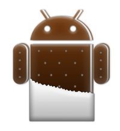

* [MyGithubProfile](#MyGitHubProfile)
  * [Your Pain Points](Your Pain Points)
* [The GrottWorkSpace System](#The GrottWorkSpace System)
  * [The Gradle Build System in the Android Context](#The Gradle Build System in the Android Context)
    * [GWSDroidGradle](#GWSDroidGradle)
  * [Test Libraries of Mine Used](#Test Libraries of Mine Used)
    * [GWSWakeUp](#GWSWakeUp)
    * [GWSDroidViewServer](#GWSDroidViewServer)
    * [GWSDroidInsUtil](#GWSDroidInsUtil)
  * [Common App Libraries](#Common App Libraries)
    * [GWSAndroidUUID](#GWSAndroidUUID)
    * [GWSCache](#GWSCache)
    * [GWSColours](#GWSColours)
    * [GWSCacheFragment](#GWSCacheFragment)
    * [GWSEasing](#GWSEasing)
    * [GWSIndiaInk](#GWSIndiaInk)
    * [GWSSpannable](#GWSSpannable)
    * [GWSSystemUI](#GWSSystemUI)
    * [GWSOttoUtils](#GWSOttoUtils)
    * [GWSEula](#GWSEula)
    * [GWSLicenseThis](#GWSLicenseThis)
    * [GWSVMUtils](#GWSVMUtils)
    * [GWSDroidUtil](#GWSDroidUtil)
  * [UI Features Back-ported Android Libraries](#UI Features Back-ported Android Libraries)
    * [GWSArcAnimations](#GWSArcAnimations)
    * [GWSArcLayout](#GWSArcLayout)
    * [GWSBetterRelativeLayout](#GWSBetterRelativeLayout)
    * [GWSBlurringView](#GWSBlurringView)
    * [GWSChips](#GWSChips)
    * [GWSDiscreteSeekBar](#GWSDiscreteSeekBar)
    * [GWSDiscrollView](#GWSDiscrollView)
    * [GWSKenBurnsView](#GWSKenBurnsView)
    * [GWSLDialogs](#GWSLDialogs)
    * [GWSListViewAnimations](#GWSListViewAnimations)
    * [GWSMaterialCAB](#GWSMaterialCAB)
    * [GWSMaterialCalendarView](#GWSMaterialCalendarView)
    * [GWSMaterialDialogs](#GWSMaterialDialogs)
    * [GWSMaterialDrawer](#GWSMaterialDrawer)
    * [GWSMaterialEdit](#GWSMaterialEdit)
    * [GWSMaterialMenu](#GWSMaterialMenu)
    * [GWSMaterialPreference](#GWSMaterialPreference)
    * [GWSMaterialProgressBar](#GWSMaterialProgressBar)
    * [GWSMaterialRangeBar](#GWSMaterialRangeBar)
    * [GWSMaterialSpinner](#GWSMaterialSpinner)
    * [GWSMultiStateView](#GWSMultiStateView)
    * [GWSObservableScroll](#GWSObservableScroll)
    * [GWSPagerSlidingTabStrip](#GWSPagerSlidingTabStrip)
    * [GWSPanningView](#GWSPanningView)
    * [GWSParallelMotion](#GWSParallelMotion)
    * [GWSReveal](#GWSReveal)
    * [GWSRoundedImageView](#GWSRoundedImageView)
    * [GWSShimmer](#GWSShimmer)
    * [GWSStickyHeadersRV](#GWSStickyHeadersRV)
    * [GWSStickyListHeaders](#GWSStickyListHeaders)
    * [GWSSVGProgressView](#GWSSVGProgressView)
    * [GWSSwipeToDismiss](#GWSSwipeToDismiss)
    * [GWSTiltEffect](#GWSTiltEffect)
    * [GWSTwoWayView](#GWSTwoWayView)
    * [GWSVelocityScroller](#GWSVelocityScroller)
    * [GWSVelocityViewPager](#GWSVelocityViewPager)
    * [GWSViewPagerTrans](#GWSViewPagerTrans)
    * [GWSZDepthShadow](#GWSZDepthShadow)
  * [Other 3rd-party Tools and Libraries Used](#Other 3rd-party Tools and Libraries Used)
  * [Android Open Source Contributions](#Android Open Source Contributions)
  * [Best Practices Followed](#Best Practices Followed)
* [Contacting Me](#Contacting Me)

MyGithubProfile
===============

I am a software engineer and developer that happens to be a computer language polyglot and an android
java application developer. So as to act as a guide to those start-up co-founders who are seeking an
android developer I have created this git repo and readme to point out some of my git repos that should
be closely examined by your engineering staff that hires android developers such as your CTO, etc.

I am also have a top 17% StackOverflow rating:

[StackOverflow Profile](http://stackoverflow.com/users/237740/fred-grott)

for using my java and android skills and experience in
answering other developers questions about android development using java.
The SO 17% top rating for android developer questions is what most senior android developers have
if they are a member of StackOverflow. And just like other senior android developers I have developed
libraries, tools, and processes that build on top of all the java, GUI, and android best practices to
ensure quality java code and quality android applications developed.

My Medium Android Development Articles can be found at my medium profile:

[Medium Profile](https://medium.com/@fredgrott)

And my Android Development blog is at:

[My Android Development blog](http://grottworkshop.blogspot.com)

And I do upload android development slides to:

[SlideShare Profile](http://www.slideshare.net/shareme)

[SpeakerDeck Profile](https://speakerdeck.com/fredgrott)

While I do not answer developer questions directly by email, I do answer questions posed as the
following places:

[Quora Profile](http://www.quora.com/Fred-Grott)

[Reddit Profile](http://www.reddit.com./user/fredgrott/)

Why portfolio this way?

The biggest part of getting the android UX of an application and the android application design right
is the big thing under the surface like an iceberg such as the actual java skills and knowledge and the
android skills and knowledge and that very important set of manual habits and java development best
practices.

A few portfolio apps only teases you without providing a concrete way to establish that the android developer
or android application engineer in fact follows those practices. Now if someone has a system to ensure that
why not show off that system? Than you would emphatically know, right?

Your Pain Points
-----------------

1. You have trouble finding that one unicorn of android developer that has actual computer science skills
   as the basis of their computer sciences skills such as mathematics as STEM people pick up new technologies and
   computer language skills and tools faster than anyone else and tedn to train themselves.

   While at Purdue University at Indianapolis I pursued a STEM intensive set of majors including mathematics.
   In plain short words that means its easy for me pick up things like RxJava which deals with such math things as
   monads, etc.

2. You probably have either the iOS developer or a CTO, etc who was an iSO developer walking you into
   blind spots as far as the UX and application implementations as they let their iOS biases creep in.
   I am an android application expert and fight for doing it right on android.

   An example is that the Facebook Reactive.js is not yet suitable for android development due to several
   deep limitations including not being able toback port new UI features so that we get a consistent
   look and feel and the annoying loosing data in views when the device orientation changes. Hence, my push
   for using RxJava instead of Facebook's Reactive.

3. Solid java skills prevent problems of varying code quality,etc, etc and I am a former Java Enterprise
   developer with a solid set of java best practices that act as my anchor to keep me always striving
   for quality code every day and every week.

4. You are new to being a co-founder and or CTO and probably new to the android OS platform. Why not take advantage
   and get real useful advice from an expert that you can use over and over again as you fill out your
   software engineering team?

   [See my Medium article. Why I don't do coffee]()

The GrottWorkSpace System
=========================

The GrottWorkSpace system is collection of manual java and android best practices, tools, and libraries
that together form a set of processes that ensure that a quality mobile android java application is
produced that is easy to test and easy to maintain and update. The following detailed libraries, tools,
and practices compose of that system.

The reasons for code auditing and cleaning up 3rd-party back-ported android UI libraries
range from using Engineering best practices to being able to rely upon other libraries to
having  a need for those libraries to be cleaned up so I can convert them to RxJava use as one cannot use
libraries that refer to views, fragments , activities and widgets but have to use Rxjava
style things that have wrapped certain things for full RxJava usage.

The Gradle Build System in the Android Context
----------------------------------------------

Without a dependable build you cannot as an android application engineer predict milestone builds or
steps in the development process.

GWSDroidGradle
--------------
[GWSDroidGradle](https://github.com/shareme/GWSDroidGradle)

This is my android specific gradle set-up that I keep current with the gradle plugins and debug tool
set up that I use to develop android applications. In the readme you will find a detailed implementation
description with the tools I use.

Test Libraries of Mine Used
---------------------------

I have created some test and debug libraries that I use for testing. Implementation description blocks in
each git repo describe the implementation involved.

GWSWakeUp
---------

[GWSWakeUp](https://github.com/shareme/GWSWakeUp)

This library allows or enables the device to wake up as the app is pushed to the device or emulator
for testing.

GWSDroidViewServer
------------------

[GWSDroidViewServer](https://github.com/shareme/GWSDroidViewServer)

GWSDroidViewServer is a library to enable a debug build of an android application to hook into the
Hierarchy View tool of the android sdk so that we can examine the view tree structure of the application.

GWSDroidInsUtil
---------------

[GWSDroidInsUtil](https://github.com/shareme/GWSDroidInsUtil)

The GWSDroidInsUtil library contains some classes that set up a testing rule to run a test multiple times
to dela with a flaky test and a class to assist in disabling system animations during test and to re-enable
system animations once testing is completed.

Common App Libraries
--------------------

I have created some common app libraries as it reduces the boilerplate I have to copy for each android
application I create. Such things as a custom type loader library, material colors, caches, etc. Implementation
description block in each git repo describes the implementation involved.

GWSAndroidUUID
--------------
[GWSAndroidUUID](https://github.com/shareme/GWSAndroidUUID)

Creates a factory class to load a shared-prefs stored UUID or create a new one in somewhat secure fashion in
protecting the androidID value. An UUID finds its use in we need to track application errors and crash
statistics by user and user usage by UUID value.

GWSCache
--------

[GWSCache](https://github.com/shareme/GWSCache)

GWSCache is a library to enable to setting of an application wide cache in the android application that
happens to be two-level, in memory and in disk-file.

GWSColors
---------

[GWSColours](https://github.com/shareme/GWSColours)

The android support libs v7 privatize resource color names so we as developers are not suppose to use them
or rely upon them. Thus instead I extended the Colours Android library to allow the setting of all the
material colours and as a bonus one gets to use the helper methods of the Colours Android library for free.

GWSCacheFragment
----------------

[GWSCacheFragment](https://github.com/shareme/GWSCacheFragment)

When a UI component called View-Pager is used in the android application to switch between multiple pages
we usually have to cache those pages and this library enables me to accomplish that goal.

GWSEasing
---------

[GWSEasing](https://github.com/shareme/GWSEasing)

Easing animation functions were not fully supplied until api 18 level and thus I use this library in api
levels lower than 18 to supply easing animation functions for UI element animations.

GWSIndiaInk
------------

[GWSIndiaInk](https://github.com/shareme/GWSIndiaInk)

GWSUIndiaInk is the library I created to enable me to load custom fonts for an android application.

GWSSpannable
------------

[GWSSpannable](https://github.com/shareme/GWSSpannable)

Its easier to do spannable than always extend text view and so I created this library to use the collection
spannables that I have created and collected.

GWSSytemUI
----------

[GWSSystemUI](https://github.com/shareme/GWSSystemUI)

A system UI element helper set of classes.

GWSOttoUtils
------------

[GWSOttoUtils](https://github.com/shareme/GWSOttoUtils)

I use the Otto even bus system to allow me to de-couple android application components and these helper
classes he me set up a proper event bus.

GWSEula
--------

[GWSEula](https://github.com/shareme/GWSEula)

In the USA and EU the legal environment requires all software applications to have an Eula so that the
application development company is protected, hence this library.

GWSLicenseThis
--------------

[GWSLicenseThis]

Library to allow displaying the application license to the user on first start of the application.

GWSVMUtils
----------

[GWSVMUtils]

Simplified ViewModel and State Machine classes to make it easier to use a ModelViewViewModel solution in
application implementations.

GWSDroidUtil
------------

[GWSDroidUtil](https://github.com/shareme/GWSDroidUtil)

Utility classes that do not fit any other category that get used to reduce boilerplate classes and methods in
android application.

GWSStateMachine
---------------

[GWSStateMachine]

Multi-purpose state machine classes in the form of a sueful library.

UI Features Back-ported Android Libraries
-----------------------------------------

With each major Google UX Design Change(the happen every 18 to 36 months) within the Android Mobile OS and
Framework platform there emerges a combination of UX work-around elements that allows 3rd-party android
application developers to get a consistent look and feel across multiple Android OS versions that reaches
about 95% of the feature-set of the current newest Android OS version. But, most of the 3rd-party back-ported
libraries are never in a full polished state that you can fully rely upon them. Whereas if one looks at
the full 'forest' of back-ported libraries and corrects them, and curates them than we get a component of
a system whereas we always know we can achieve the consisten UX look and feel.

I created some UI Feature back-ported android libraries that corrected compatibility issues and made
the libraries more reliable for developers to use including myself. Most them contain both a descriptive
implementation description in the readme and a demo signed apk app file in the demo folder to try out.

If the newest feature is not in these libraries it probably cannot be back-ported.

GWSArcAnimations
----------------

[GWSArcAnimations](https://github.com/shareme/GWSArcAnimations)

Helps me create arc transitions.

GWSArcLayout
------------

[GWSArcLayout](https://github.com/shareme/GWSArclayout)

An arc layout

GWSBetterRelativeLayout
-----------------------

[GWSBetterRelativeLayout](https://github.com/shareme/GWSBetterRelativeLayout)

A better relative layout

GWSBlurringView
---------------

[GWSBlurringView](https://github.com/shareme/GWSBlurringView)

A blurring view.

GWSChips
---------

[GWSChips](https://github.com/shareme/GWSChips)

Displays little chips as an edit text view is filled out by the user

GWSDiscreteSeekBar
------------------

[GWSDiscreteSeekBar](https://github.com/GWSDiscreteSeekBar)

Its a discrete slider just like in the Google material Design docs.

GWSDiscrollView
---------------

[GWSDiscrollView](https://github.com/shareme/GWSDiscrollView)

Widgets appear by fade or other transittions as you scorll.

GWSKenBurnsView
---------------

[GWSKenBurnsView](https://github.com/shareme/GWSKenBurnsView)

Provides an extension to image view to enable the Ken Burns effect.

GWSLDialogs
-----------

[GWSLDialogs](https://github.com/shareme/GWSLDialogs)

L-style dialogs

GWSListViewAnimations
---------------------

[GWSListViewAnimations](https://github.com/shareme/GWSListViewAnimations)

List view animations

GWSMaterialCAB
---------------

[GWSMaterialCAB](https://github.com/shareme/GWSMaterialCAB)

A material contextual action bar

GWSMaterialCalendarView
-----------------------

[GWSMaterialCalendarView](https://github.com/shareme/GWSMaterialCalendarView)

A Material design back port of Android's CalendarView.

GWSMaterialDialogs
------------------

[GWSMaterialDialogs]

Makes building material styled dialogs easier.

GWSMaterialDrawer
------------------

[GWSMaterialDrawer](https://github.com/shareme/GWSmaterialDrawer)

Makes it easier to build materail styled drawers.

GWSMaterialEdit
---------------

[GWSMaterialEdit](https://github.com/shareme/GWSMaterialEdit)

A material styled edit text view

GWSMaterialMenu
---------------

[GWSMaterialMenu](https://github.com/shareme/GWSMaterialMenu)

Morphing Android menu, back, dismiss and check buttons

GWSMaterialPreference
---------------------

[GWSMaterialPreference](https://github.com/shareme/GWSMaterialPreference)

GWSMaterialProgressBar
----------------------

[GWSMaterialProgressBar](https://github.com/GWSMaterialProgressBar)

Material design ProgressBar with consistent appearance.

GWSMaterialRangeBar
-------------------

[GWSMaterialRangeBar](https://github.com/shareme/GWSmaterailRangeBar)

Material styled rangebar.

GWSMaterialSpinner
------------------

[GWSMaterialSpinner](https://github.com/shareme/GWSMaterialSpinner)

This library provides you a Spinner with the Material style.

GWSMultiStateView
------------------

[GWSMultiStateView](https://github.com/shareme/GWSMultiStateView)

Shows loading, error, etc states in a view so that user has some feedback about the progress of the
application.

GWSObservableScroll
-------------------

[GWSObservableScroll]

GWSPagerSlidingTabStrip
-----------------------

[GWSPagerSlidingTabStrip]

Interactive paging indicator widget material styled.

GWSPanningView
--------------

[GWSPanningView]

PanningView is a library which implements the animated background in the now playing screen of the Play Music app.

GWSParallelMotion
------------------

[GWSParallelMotion]

GWSReveal
---------

[GWSReveal]

The Reveal feature back-ported.

GWSRoundedImageView
--------------------

[GWSRoundedImageView]

GWSShimmer
-------------

[GWSShimmer]

GWSStickyHeadersRV
-------------------

[GWSStickyHeadersRV]

GWSStickyListHeaders
---------------------

[GWSStickyListHeaders]

GWSSVGProgressView
-------------------

[GWSSVGProgressView]

A different out-look on what a progress view should do as far as branding.

GWSSwipeToDismiss
-----------------

[GWSSwipeToDismiss]

GWSTiltEffect
--------------

[GWSTiltEffect]

GWSTwoWayView
-------------

[GWSTwoWayView]

GWSVelocityScroller
--------------------

[GWSVelocityScroller]

GWSVelocityViewPager
----------------------

[GWSVelocityViewPager]

GWSViewPagerTrans
-----------------

[GWSViewPagerTrans]

View pager transitions.

GWSZDepthShadow
----------------

[GWSZDepthShadow]

Z-Depth Shadow feature back-ported.

Other 3rd-party Tools and Libraries Used
----------------------------------------

[Hugo]()

[LeakCanary](https://github.com/square/leakcanary)

[Otto](http://github.com/square/otto)

[Picasso](http://square.github.io/picasso/)

[OkHttp]()

[ProjectLombok]()

[Timber](http://github.com/JakeWharton/timber)

[Butterknife](http://jakewharton.github.io/butterknife/)

[Spoon]()

[Renderers]()

[Espresso]()

[Mockito]()

[Madge]()

[AssertJForAndroid]()

[AssertJ]()

[RxJava]()

[Retro-Lambda]()

[View-inspector(Scalpel and Probe)]()

[Kotlin]()

[Gradle]()

[Groovy]()

Android Open Source Contributions
---------------------------------

I like most android advance application developers contribute to the Android AOSP project and these
following 3rd-party libraries:

Best Practices Followed
------------------------

1. Keeping things on the proper thread, inflate and resource stuff is always on the UI thread while
   some longer running shared prefs editing we try to have on a non ui thread.

2. Make sure that all the stuff that could be transformed to using generics is in fact done and if
   not than mark it with an supper warnings unchecked to let other devs know that this process was completed.

3. Mark all depreciated classes and methods as supper warnings depreciated as in apps you have to
   do this anyway as the proguard will not obfuscate without it completed.

4. Using patterns and compound patterns where appropriate to structure the library or application in
   a way makes it more modular and efficient.

5. Only have logs showing in debug and not production builds as the only thing that should in
   application logs production wise is the crash stuff and that should be a rarity not something
   that happens often.

6. Using different methods and tools to de-couple classes, modules, etc so that we can more
   effectively test using instrumented testing and functional testing.

7. Reading Android AOSP project sources as the Google Engineers put helpful comments and from time
   to time find stuff that should be back proted to use on older versions of the android OS as well
   new ways to re-use some classes and methods.

8. Making sure to have things executed on the proper step within the Application, Activity, Fragment,
   and View life-cycles.

9. Applying color theory, typography and graphics design in an design and brand marketing appropriate
   manner in the android UX design context and Google Material design context.

10. Being aware of what the limitations to the tools and libraries used in my android development
    stack as it pertains to solving the problems-at-hand in developing a specific android application.

Contacting Me
-------------

Rules for contacting me:

1. Not a recruiter but a start-up founder or co-founder

2. If start-up than its seed capital 'run-way' is fully funded at $1 Million or more.

3. If a Chicago start-up than willing to travel to my NorthWest Indiana location and discuss over a
   paid subway meal and discuss a relocation.

4. If not a Chicago start-up than willing to allow me to do remote(as I prefer not to devote 50%
   of my net income towards extremely high apartment rents and leasing) and enter a lengthy and informative
   discussion about your android application development needs.

5. It has to be android java application development not anything touching C/C++ or
   embedded development. If you really want embedded and cannot find any one than its  somewhat 200%
   of the android java application market price at 1099 with a cash advance.

6. I only find qualified android developers for recruitment purposes on paid-commission re-using tools
   and processes from my GrottWorkSpace system and the pricing starts at $95,000 per developer needed.
   Please do not ask for freebies.

7. Obviously, do not pull the recruiter crap and seek my Google-Voice-Number to call me daily to
   inquire about recruiting me as my quiet coding time is somewhat important to me.

If you can follow those rules than you can email me at:

fred DOT grott AT gmail DOT com
